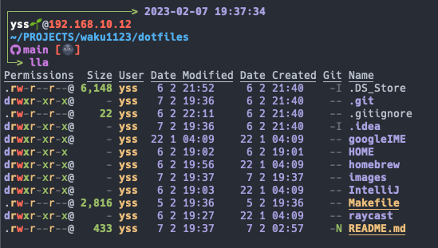

# sugawarayss's dotfiles
My dotfiles for MacOSX.

## Quick Start

- run `make <target keyword>`
    - details see [Makefile](./Makefile)

## Contents
- [zsh](https://zsh.sourceforge.io/Doc/Release/zsh_toc.html) - resource files for zsh
- [Homebrew](https://brew.sh/index_ja) - my Brewfile
- [Git](https://git-scm.com/) - git global configuration files
- [Tig](https://github.com/jonas/tig) - keybinds configuration
- [Starship](https://starship.rs/ja-jp/) - my prompt configuration
- [NeoVim](https://neovim.io/doc/user/index.html) - my neovim configuration and plugins
- [Helix](https://helix-editor.com/) - my helix configuration
- [ideavim](https://pleiades.io/help/idea/using-product-as-the-vim-editor.html) - Jetbrains IDE vim plugin keybind configuration
- [Warp.app](https://www.warp.dev/) - terminal app made by rust

### Neovim Plugins

| Plugin Name                                                                                         | Description                                                    |
| --------------------------------------------------------------------------------------------------- | -------------------------------------------------------------- |
| [wbthomason/packer.nvim](https://github.com/wbthomason/packer.nvim)                                 | plugin/package management plugin for NeoVim                    |
| [EdenEast/noghtfox.nvim](https://github.com/EdenEast/nightfox.nvim)                                 | color theme for NeoVim                                         |
| [sunjon/Shade.nvim](https://github.com/sunjon/Shade.nvim)                                           | dims inactive windows                                          |
| [lambdalisue/fern.vim](https://github.com/lambdalisue/fern.vim)                                     | general purpose asynchronous file tree viewer                  |
| [lambdalisue/nerdfont.vim](https://github.com/lambdalisue/nerdfont.vim)                             | for use NerdFont                                               |
| [lambdalisue/fern-renderer-nerdfont.vim](https://github.com/lambdalisue/fern-renderer-nerdfont.vim) | for use NerdFont at Fern                                       |
| [lambdalisue/fern-git-status.vim](https://github.com/lambdalisue/fern-git-status.vim)               | display git status at file tree of Fern                        |
| [yuki-yano/fern-preview.vim](https://github.com/yuki-yano/fern-preview.vim)                         | display file preview in floating window at Fern                |
| [akinsho/bufferline.nvim](https://github.com/akinsho/bufferline.nvim)                               | display file/line status                                       |
| [hrsh7th/nvim-cmp](https://github.com/hrsh7th/nvim-cmp)                                             | Completion Engine                                              |
| [hrsh7th/cmp-buffer](https://github.com/hrsh7th/cmp-buffer)                                         | completion source for buffer words                             |
| [hrsh7th/cmp-path](https://github.com/hrsh7th/cmp-path)                                             | completion source for filesystem path                          |
| [hrsh7th/vim-vsnip](https://github.com/hrsh7th/vim-vsnip)                                           | LSP's snippet                                                  |
| [hrsh7th/cmp-nvim-lsp](https://github.com/hrsh7th/cmp-nvim-lsp)                                     | completion source for neovim's built-in language server client |
| [onsails/lspkind.nvim](https://github.com/onsails/lspkind.nvim)                                     | diaplay pictograms to completion list                          |
| [j-hui/fidget.nvim](https://github.com/j-hui/fidget.nvim)                                           | display LSP progression                                        |
| [ray-x/lsp_signature.nvim](https://github.com/ray-x/lsp_signature.nvim)                             | show function signature                                        |
| [jose-elias-alvarez/null-ls.nvim](https://github.com/jose-elias-alvarez/null-ls.nvim)               | use Neovim as a language server to inject LSP diagnostics      |
| [williamboman/mason.nvim](https://github.com/williamboman/mason.nvim)                               | manage language server                                         |
| [williamboman/mason-lspconfig.nvim](https://github.com/williamboman/mason-lspconfig.nvim)           | bridge mason.nvim with neovim lspconfig                        |
| [neovim/nvim-lspconfig](https://github.com/neovim/nvim-lspconfig)                                   | configs for Neovim LSP client                                  |
| [jay-babu/mason-null-ls.nvim](https://github.com/jay-babu/mason-null-ls.nvim)                       | bridge mason.nvim with null-ls                                 |
| [voldikss/vim-floaterm](https://github.com/voldikss/vim-floaterm)                                   | use terminal in floating window                                |
| [folke/noice.nvim](https://github.com/folke/noice.nvim)                                             | UI(cmdline, notify, message) extension                         |
| [vim-denops/denops.vim](https://github.com/vim-denops/denops.vim)                                   | deno ecosystem for Neovim                                      |
| [nvim-telescope/telescope.nvim](https://github.com/nvim-telescope/telescope.nvim)                   | fuzzy finder                                                   |
| [sudormrfbin/cheatsheet.nvim](https://github.com/sudormrfbin/cheatsheet.nvim)                       | display cheatsheet at telescope popup                          |
| [lpoto/telescope-docker.nvim](https://github.com/lpoto/telescope-docker.nvim)                       | control docker commands at telescope popup                     |
| [kyazdani42/nvim-web-devicons](https://github.com/nvim-tree/nvim-web-devicons)                      | display icons at telescope fuzzy finder result                 |
| [tpope/vim-commentary](https://github.com/tpope/vim-commentary)                                     | comment out                                                    |
| [folke/todo-comments.nvim](https://github.com/folke/todo-comments.nvim)                             | auto highlight TODO comment                                    |
| [lukas-reineke/indent-blankline.nvim](https://github.com/lukas-reineke/indent-blankline.nvim)       | display indentation guides                                     |
| [andymass/vim-matchup](https://github.com/andymass/vim-matchup)                                     | jump to match keywords                                         |
| [windwp/nvim-autopairs](https://github.com/windwp/nvim-autopairs)                                   | auto close parentheses                                         |
| [rgroli/other.nvim](https://github.com/rgroli/other.nvim)                                           | jump to code,test code inter file                              |
| [kylechui/nvim-surround](https://github.com/kylechui/nvim-surround)                                 | enhanced surround selections                                   |
| [stevearc/aerial.nvim](https://github.com/stevearc/aerial.nvim)                                     | display code outline                                           |
| [iamcco/markdown-preview.nvim](https://github.com/iamcco/markdown-preview.nvim)                     | markdown preview                                               |
| [nvim-treesitter/nvim-treesitter](https://github.com/nvim-treesitter/nvim-treesitter)               | syntax highlight                                               |
| [nvim-treesitter/playground](https://github.com/nvim-treesitter/playground)                         | view treesitter infomation directly in Neovim                  |
| [machakann/vim-sandwich](https://github.com/machakann/vim-sandwich)                                 | add/delete/replace surroundings to textobject                  |
| [dinhhuy258/git.nvim](https://github.com/dinhhuy258/git.nvim)                                       | git wrapper for Neovim                                         |
| [nvim-lualine/lualine.nvim](https://github.com/nvim-lualine/lualine.nvim)                           | enhance status line of Neovim                                  |
| [rktjmp/lush.nvim](https://github.com/rktjmp/lush.nvim)                                             | colorscheme creation aid for Neovim                            |
| [itchyny/vim-gitbranch](https://github.com/itchyny/vim-gitbranch)                                   | display git branch name to status bar of Neovim                |
| [lewis6991/gitsigns.nvim](https://github.com/lewis6991/gitsigns.nvim)                               | display git blame/line status to buffer                        |
| [Decodetalkers/csv-tools.lua](https://github.com/Decodetalkers/csv-tools.lua)                       | column highlight at csv file                                   |

