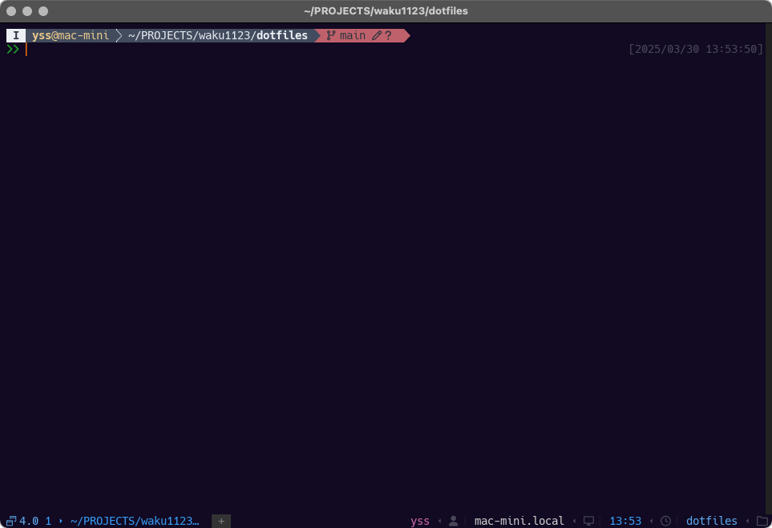

# dotfiles

My dotfiles for MacOSX.




## Setup

  run following shell script by zsh

  ```shell
  /bin/zsh ./setup.sh
  ```

## Contents

this repo include configuration files of following tools

### Shell

- [zsh](./HOME/.zshrc)
- [fish](./HOME/.config/fish)
- [Starship](./HOME/.config/starship.toml)

### CLI

- [Homebrew](./homebrew/Brewfile)
- [Git](./HOME/.config/git)
  - [gh](./HOME/.config/gh/)
    - [gh-dash](./HOME/.config/gh-dash/)
    - gh-notify
    - gh-copilot
- [lazygit](./HOME/.config/lazygit/)
- [mise](./HOME/.config/mise/)
- [yazi](./HOME/.config/yazi/)
- [superfile](./HOME/.config/superfile/)

### GUI Apps

- [raycast.app](./raycast/)

### Editors

- [Neovim](./HOME/.config/nvim/)
- [ideavim](./HOME/.ideavimrc)
- [zed](./HOME/.config/zed/)
- [IntelliJ IDEA](./IntelliJ/)
  - [File Watcher Plugin Profiles](./IntelliJ/FileWatcher/)

### Linters

- [yamllint](./HOME/.config/yamllint/)
- [markdownlint](./HOME/.config/markdownlint/)

### Terminal Multi Plexer

- [Warp.app](./HOME/.warp/)
- [Wezterm.app](./HOME/.config/wezterm/)
- [ghostty.app](./HOME/.config/ghostty/)

