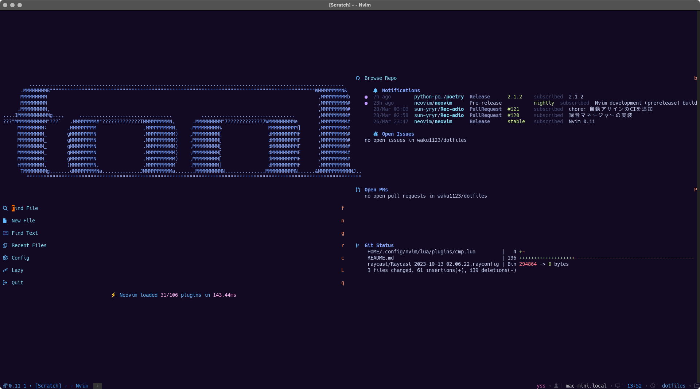

# dotfiles

My dotfiles for MacOSX.



## Setup

  run following shell script by zsh

  ```shell
  /bin/zsh ./setup.sh
  ```

## Contents

- [zsh](https://zsh.sourceforge.io/Doc/Release/zsh_toc.html)
- [Homebrew](https://brew.sh/index_ja)
- [Git](https://git-scm.com/)
- [Starship](https://starship.rs/ja-jp/)
- [NeoVim](https://neovim.io/doc/user/index.html)
- [ideavim](https://pleiades.io/help/idea/using-product-as-the-vim-editor.html)
- [Warp.app](https://www.warp.dev/)
- [Wezterm.app](https://wezfurlong.org/wezterm/index.html)

## Neovim Plugins

| Plugin Name                                                                                           |
| ----------------------------------------------------------------------------------------------------- |
| [stevearc/aerial.nvim](https://github.com/stevearc/aerial.nvim)                                       |
| [goolord/alpha-nvim](https://github.com/goolord/alpha-nvim)                                           |
| [akinsho/bufferline.nvim](https://github.com/akinsho/bufferline.nvim)                                 |
| [kwkarlwang/bufresize.nvim](https://github.com/kwkarlwang/bufresize.nvim)                             |
| [tyru/capture.vim](https://github.com/tyru/capture.vim)                                               |
| [hrsh7th/cmp-buffer](https://github.com/hrsh7th/cmp-buffer)                                           |
| [hrsh7th/cmp-nvim-lsp](https://github.com/hrsh7th/cmp-nvim-lsp)                                       |
| [hrsh7th/cmp-path](https://github.com/hrsh7th/cmp-path)                                               |
|  [zbirenbaum/copilot.lua](https://github.com/zbirenbaum/copilot.lua) |
| [CopilotC-Nvim/CopilotChat.nvim](https://github.com/CopilotC-Nvim/CopilotChat.nvim)                   |
| [Shougo/ddc.vim](https://github.com/Shougo/ddc.vim)                                                   |
| [vim-denops/denops.vim](https://github.com/vim-denops/denops.vim)                                     |
| [sindrets/diffview.nvim](https://github.com/sindrets/diffview.nvim) |
| [j-hui/fidget.nvim](https://github.com/j-hui/fidget.nvim)                                             |
| [lewis6991/gitsigns.nvim](https://github.com/lewis6991/gitsigns.nvim)                                 |
| [shellRaining/hlchunk.nvim](https://github.com/b0o/incline.nvim) |
| [hadronized/hop.nvim](https://github.com/hadronized/hop.nvim) |
| [b0o/incline.nvim](https://github.com/b0o/incline.nvim) |
| [lambdalisue/kensaku-command.vim](https://github.com/lambdalisue/kensaku-command.vim)                 |
| [lambdalisue/kensaku-search.vim](https://github.com/lambdalisue/kensaku-search.vim/tree/main)         |
| [lambdalisue/kensaku.vim](https://github.com/lambdalisue/kensaku.vim)                                 |
| [rapan931/lasterisk.nvim](https://github.com/rapan931/lasterisk.nvim) |
| [folke/lazy.nvim](https://github.com/folke/lazy.nvim)                                                 |
| [onsails/lspkind.nvim](https://github.com/onsails/lspkind.nvim)                                       |
| [nvimdev/lspsaga.nvim](https://github.com/nvimdev/lspsaga.nvim) |
| [nvim-lualine/lualine.nvim](https://github.com/nvim-lualine/lualine.nvim)                             |
| [williamboman/mason-lspconfig.nvim](https://github.com/williamboman/mason-lspconfig.nvim)             |
| [jay-babu/mason-null-ls.nvim](https://github.com/jay-babu/mason-null-ls.nvim)                         |
| [williamboman/mason.nvim](https://github.com/williamboman/mason.nvim)                                 |
| [nvim-neo-tree/neo-tree.nvim](https://github.com/nvim-neo-tree/neo-tree.nvim) |
| [folke/noice.nvim](https://github.com/folke/noice.nvim)                                               |
| [nvimtools/none-ls.nvim](https://github.com/nvimtools/none-ls.nvim)                                   |
| [myusuf3/numbers.vim](https://github.com/myusuf3/numbers.vim)                                         |
| [windwp/nvim-autopairs](https://github.com/windwp/nvim-autopairs)                                     |
| [hrsh7th/nvim-cmp](https://github.com/hrsh7th/nvim-cmp)                                               |
| [norcalli/nvim-colorizer.lua](https://github.com/norcalli/nvim-colorizer.lua)                         |
| [kevinhwang91/nvim-hlslens](https://github.com/kevinhwang91/nvim-hlslens)                             |
| [neovim/nvim-lspconfig](https://github.com/neovim/nvim-lspconfig)                                     |
| [petertriho/nvim-scrollbar](https://github.com/petertriho/nvim-scrollbar)                             |
| [kylechui/nvim-surround](https://github.com/kylechui/nvim-surround)                                   |
| [nvim-treesitter/nvim-treesitter](https://github.com/nvim-treesitter/nvim-treesitter)                 |
| [nvim-treesitter-context](https://github.com/nvim-treesitter/nvim-treesitter-context) |
| [nvim-treesitter-textsubjects](https://github.com/RRethy/nvim-treesitter-textsubjects) |
| [kevinhwang91/nvim-ufo](https://github.com/kevinhwang91/nvim-ufo)                                     |
| [pwntester/octo.nvim](https://github.com/pwntester/octo.nvim) |
| [mrcjkb/rustaceanvim](https://github.com/mrcjkb/rustaceanvim?tab=readme-ov-file) |
| [vim-skk/skkeleton](https://github.com/vim-skk/skkeleton)                                             |
| [delphinus/skkeleton_indicator.nvim](https://github.com/delphinus/skkeleton_indicator.nvim)           |
| [danielfalk/smart-open.nvim](https://github.com/danielfalk/smart-open.nvim)                           |
| [edluffy/specs.nvim](https://github.com/edluffy/specs.nvim)                                           |
| [luukvbaal/statuscol.nvim](https://github.com/luukvbaal/statuscol.nvim)                               |
| [jonarrien/telescope-cmdline.nvim](https://github.com/jonarrien/telescope-cmdline.nvim?tab=readme-ov-file) |
| [lpoto/telescope-docker.nvim](https://github.com/lpoto/telescope-docker.nvim)                         |
| [nvim-telescope/telescope-ui-select.nvim](https://github.com/nvim-telescope/telescope-ui-select.nvim) |
| [nvim-telescope/telescope.nvim](https://github.com/nvim-telescope/telescope.nvim)                     |
| [folke/todo-comments.nvim](https://github.com/folke/todo-comments.nvim)                               |
| [tokyonight.nvim](https://github.com/folke/tokyonight.nvim) |
| [RRenthy/vim-illuminate](https://github.com/RRethy/vim-illuminate)                                    |
| [sudormrfbin/cheatsheet.nvim](https://github.com/sudormrfbin/cheatsheet.nvim)                         |
| [Decodetalkers/csv-tools.lua](https://github.com/Decodetalkers/csv-tools.lua)                         |
| [monaqa/dial.nvim](https://github.com/monaqa/dial.nvim)                                               |
| [mfussenegger/nvim-dap](https://github.com/mfussenegger/nvim-dap)                                     |
| [mfussenegger/nvim-dap-python](https://github.com/mfussenegger/nvim-dap-python)                       |
| [rcarriga/nvim-dap-ui"](https://github.com/rcarriga/nvim-dap-ui)                                      |
| [iamcco/markdown-preview.nvim](https://github.com/iamcco/markdown-preview.nvim)                       |
| [nvim-neotest/neotest](https://github.com/nvim-neotest/neotest) |
| [epwalsh/obsidian.nvim](https://github.com/epwalsh/obsidian.nvim) |
| [mechatroner/rainbow_csv](https://github.com/mechatroner/rainbow_csv)                                 |
| [alinsho/toggleterm.nvim](https://github.com/akinsho/toggleterm.nvim)                                 |
| [kana/vim-smartword](https://github.com/kana/vim-smartword)                                           |
| [voldikss/vim-translator](https://github.com/voldikss/vim-translator)                                 |
| [folke/which-key.nvim](https://github.com/folke/which-key.nvim)                                       |
| [simeji/winresizer](https://github.com/simeji/winresizer)                                             |
